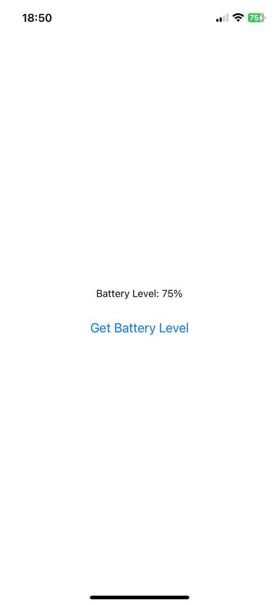

# RTN Device Info

Example of a simple battery level with TurboModules in a React Native app

## Demo

**Android:**


**iOS:**



## Installation

### 1. Setup the Example Project

Navigate to the `example` directory:

```sh
cd example
```

### 2. Add the Device Info Module

Add the rtn-device-info module to the project:

```sh
yarn add ../rtn-device-info
```
### 3. Generate Codegen Artifacts for iOS

Run the following command to generate codegen artifacts for iOS:

```sh
cd ..
node example/node_modules/react-native/scripts/generate-codegen-artifacts.js \
  --targetPlatform ios \
  --path example/ \
  --outputPath rtn-device-info/generated/
```

### 4. Install Dependencies in Example

Return to the example directory and install the device info module:

```sh
cd example
yarn add ../rtn-device-info
```

### 5. Install CocoaPods for iOS

If you are working with iOS, install the required CocoaPods dependencies:

```sh
cd ios
RCT_NEW_ARCH_ENABLED=1 pod install
```
### 6. Generate Codegen Artifacts for Android

If you are working with Android, generate the required codegen artifacts:

```sh
cd android
./gradlew generateCodegenArtifactsFromSchema
```

## Usage

```js
import RTNDeviceInfo from 'rtn-device-info/js/NativeRTNDeviceInfo';

const App = () => {

    const handleGetBatteryLevel = async () => {
        try {
            await RTNDeviceInfo?.getBatteryLevel();
        } catch (error) {
            console.error('Error getting battery level:', error);
        }
    };
}
```
